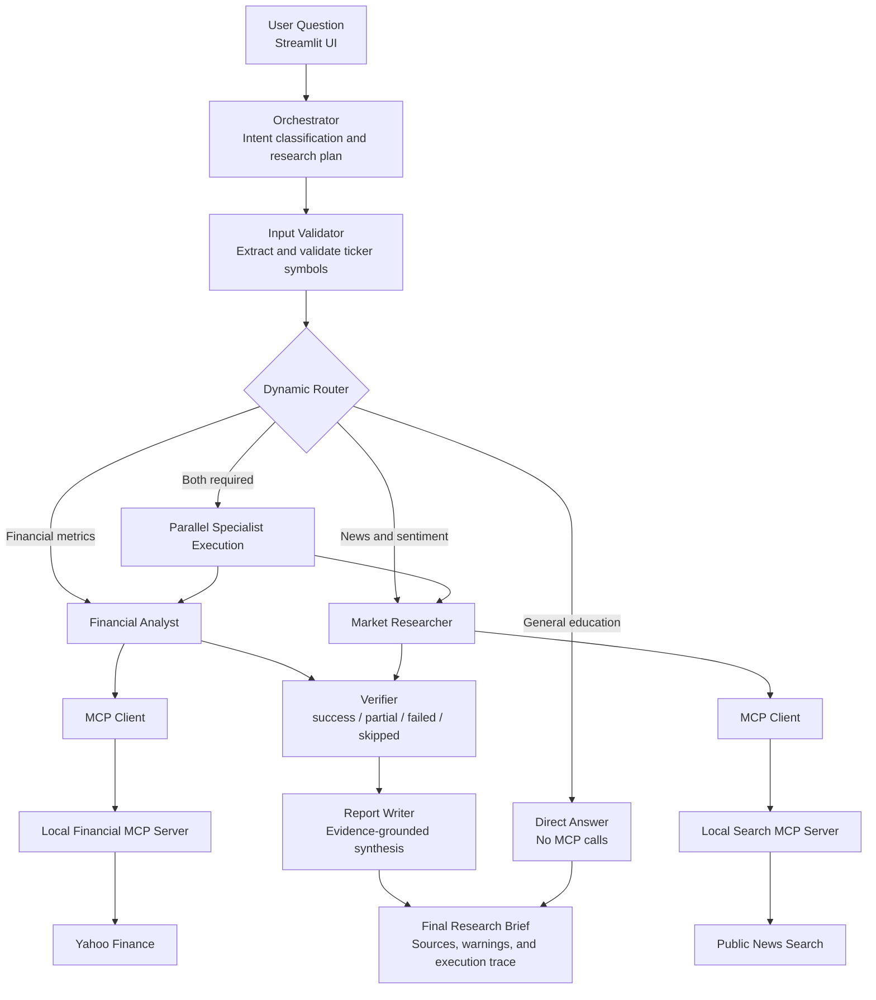

# Multi-Agent Financial Research System

A **no-RAG financial research system** built with **OpenAI**, **LangGraph**, **Streamlit**, and
local **Model Context Protocol (MCP)** servers.

The application routes each question to the specialists it actually needs, retrieves live market
and financial information through MCP, validates partial failures, and produces a grounded
research brief with an observable execution trace.

> A dynamic multi-agent workflow for real-time financial research—without vector databases,
> embeddings, or document retrieval pipelines.

---

## Architecture



### Flow overview

```text
User question
    ↓
Orchestrator creates a structured routing plan
    ↓
Input Validator extracts and validates ticker symbols
    ↓
Dynamic Router
    ├── Financial Analyst → Financial MCP → Yahoo Finance
    ├── Market Researcher → Search MCP → public news search
    ├── Both specialists in parallel
    └── Direct Answer for general educational questions
    ↓
Verifier checks completion, invalid tickers, and partial results
    ↓
Report Writer synthesizes only the available research evidence
    ↓
Streamlit displays the report, warnings, research plan, and execution trace
```

---

## System Design

### Orchestrator

The Orchestrator converts a user question into a structured plan and determines whether the
request needs:

- financial metrics and valuation analysis;
- market news, catalysts, and sentiment research;
- both specialists running in parallel; or
- a direct educational answer without external tools.

The graph does not run every agent for every question. A market-only request skips the Financial
Analyst, and a financial-only request skips the Market Researcher.

### Input Validator

Before specialist research begins, the validator:

- combines ticker symbols produced by the planner with explicit uppercase ticker-like tokens in
  the original question;
- validates each candidate through the Financial MCP server;
- separates valid and invalid tickers; and
- records invalid inputs instead of silently dropping them.

For example, `Compare INVALIDXYZ with AAPL on valuation` keeps the valid AAPL analysis but marks
the overall result as `partial` and explicitly reports that `INVALIDXYZ` is unavailable.

### Financial Analyst

The Financial Analyst uses the local Financial MCP server to retrieve and compare:

- current price and market capitalization;
- trailing and forward P/E;
- revenue growth;
- profit margin; and
- 52-week performance.

It is instructed not to invent missing metrics and not to query tickers that failed validation.

### Market Researcher

The Market Researcher uses the local Search MCP server to investigate:

- recent company news;
- product and earnings catalysts;
- market risks;
- publisher and publication date; and
- evidence-supported market sentiment.

The agent must distinguish retrieved facts from its interpretation and retain returned URLs.

### Verifier

The Verifier evaluates specialist execution before report generation. Each specialist can finish
with one of four states:

| Status | Meaning |
|---|---|
| `success` | The selected task completed normally. |
| `partial` | Useful evidence exists, but part of the request could not be completed. |
| `failed` | The selected task produced no usable research result. |
| `skipped` | The Orchestrator did not select this specialist. |

A failed specialist does not automatically discard successful work from another branch. The
final report instead discloses the missing evidence and limitations.

### Report Writer

The Report Writer receives the original question, specialist findings, sources, validation
results, warnings, and errors. It synthesizes a readable brief without independently retrieving
new facts, reducing the risk of unsupported claims entering during the writing stage.

---

## Core Features

- Dynamic multi-agent routing with LangGraph
- Parallel financial and market research when both are required
- Local stdio MCP servers with LangChain MCP adapters
- Real-time financial metrics through Yahoo Finance
- Public news search for catalysts, risks, and market sentiment
- Deterministic ticker extraction plus MCP-based validation
- Explicit handling of invalid and partially valid comparisons
- Direct-answer path for general financial education questions
- Evidence-aware verification and report synthesis
- Streamlit UI with research plan, ticker validation, warnings, and execution trace
- LLM-as-a-Judge evaluation with deterministic routing checks
- No RAG, vector database, embeddings, or document ingestion pipeline

---

## Tech Stack

| Layer | Technology |
|---|---|
| LLM | OpenAI via `langchain-openai` |
| Orchestration | LangGraph |
| Tool protocol | Model Context Protocol (MCP) |
| MCP transport | Local stdio |
| Financial data | Yahoo Finance via `yfinance` |
| News search | DDGS |
| UI | Streamlit |
| Data validation | Pydantic |
| Package management | uv |
| Runtime | Python 3.11+ |
| Quality | Ruff and Pytest |

---

## Installation

### 1. Install uv

Follow the [uv installation guide](https://docs.astral.sh/uv/getting-started/installation/), or use:

```bash
pip install uv
```

### 2. Clone the repository

```bash
git clone https://github.com/CCao666/Financial-Research-Agent.git
cd Financial-Research-Agent
```

### 3. Install the project

```bash
uv sync --python 3.11
```

### 4. Configure the environment

```bash
cp .env.example .env
```

Add your OpenAI API key to `.env`:

```env
OPENAI_API_KEY=your_openai_api_key
OPENAI_MODEL=gpt-4o-mini
```

You can optionally configure a separate model for evaluation:

```env
JUDGE_MODEL=gpt-4o-mini
```

Never commit `.env`. It is already excluded by `.gitignore`.

---

## Running the Application

```bash
uv run streamlit run app.py
```

Streamlit will print a local URL, normally:

```text
http://localhost:8501
```

The two local MCP servers are launched over stdio when needed. They do not need to be started
manually.

---

## Example Queries

### Market research only

```text
What are the latest catalysts, risks, and market sentiment for TSLA?
```

Expected route: `market_researcher`; `financial_analyst` is skipped.

### Financial analysis only

```text
Compare AAPL and MSFT on valuation, revenue growth, profitability, and market capitalization.
```

Expected route: `financial_analyst`; `market_researcher` is skipped.

### Parallel multi-agent research

```text
Compare NVDA and AMD on valuation, growth, profitability, recent catalysts, and market sentiment.
```

Expected route: Financial Analyst and Market Researcher run in parallel.

### Partial result handling

```text
Compare INVALIDXYZ with AAPL on valuation.
```

Expected behavior: AAPL remains available, `INVALIDXYZ` is reported as invalid, and the result is
marked `partial` rather than presented as a complete comparison.

### Direct educational answer

```text
What is forward P/E, and how is it different from trailing P/E?
```

Expected route: `direct_answer`; no MCP tools are called.

---

## Evaluation

The project includes a 10-question LLM-as-a-Judge suite covering:

- market-only routing;
- financial-only routing;
- parallel multi-agent routing;
- mixed valid and invalid tickers;
- fully invalid ticker input;
- direct educational answers; and
- answer quality across financial and news research tasks.

Three primary metrics are evaluated:

### Router Accuracy

Measures whether the graph selected exactly the expected agents and correctly handled valid and
invalid ticker symbols. The suite also performs deterministic route and ticker-set comparisons so
this metric does not rely exclusively on subjective LLM judgment.

### Relevance

Measures whether the final response directly covers the requested topics without material
omissions or irrelevant analysis.

### Groundedness

Measures whether material claims in the final report are supported by the specialist/MCP evidence
provided to the Judge. This measures faithfulness to captured evidence; it is not an independent
fact-check of external providers.

| Metric | Score |
|---|---:|
| Router Accuracy | **93%** |
| Relevance | **98%** |
| Groundedness | **98%** |

Run a one-case smoke evaluation:

```bash
uv run python -m evals.run_eval --limit 1
```

Run the complete 10-question suite:

```bash
uv run python -m evals.run_eval
```

Each case passes only when:

- deterministic agent routing matches the expectation;
- valid and invalid ticker sets match the expectation;
- all three Judge scores meet the configured threshold;
- and no critical failure is detected.

Detailed JSON and Markdown reports are generated under `evals/results/`. Generated results are
excluded from Git by default.

---

## Testing and Quality Checks

```bash
uv run ruff check .
uv run pytest -q
```

The automated tests cover:

- graph route selection;
- skipped-agent handling;
- explicit ticker extraction;
- MCP content-block parsing;
- partial and failed verification states;
- parallel state merging; and
- evaluation dataset integrity.

---

## Project Structure

```text
Financial-Research-Agent/
├── app.py                         # Streamlit interface
├── agent.py                       # LangGraph definition and dynamic routing
├── state.py                       # Shared graph state and reducers
├── mcp_client.py                  # Local MCP server configuration and tool loading
├── pyproject.toml                 # Project metadata and uv dependencies
├── uv.lock                        # Reproducible dependency lockfile
│
├── agents/
│   ├── orchestrator.py            # Structured planning and agent selection
│   ├── input_validator.py         # Ticker extraction and validation
│   ├── financial_analyst.py       # Financial specialist
│   ├── market_researcher.py       # News and sentiment specialist
│   ├── verifier.py                # Completion and quality state checks
│   ├── report_writer.py           # Evidence-grounded synthesis
│   └── direct_answer.py           # No-tool educational answers
│
├── mcp_servers/
│   ├── financial_server.py        # Ticker validation and financial metrics
│   └── search_server.py           # Public market-news search
│
├── models/
│   └── research.py                # Structured plan and finding models
│
├── evals/
│   ├── questions.jsonl            # 10-question evaluation dataset
│   ├── run_eval.py                # LLM-as-a-Judge runner
│   └── README.md                  # Evaluation methodology
│
└── tests/
    ├── test_routing.py
    ├── test_verifier.py
    ├── test_state.py
    └── test_evals.py
```

---

## Known Limitations

- Yahoo Finance and public news search are third-party data sources and can be unavailable,
  delayed, incomplete, or rate-limited.
- News sentiment is an LLM interpretation of retrieved search results, not a quantitative trading
  signal.
- Ticker extraction is optimized for explicit uppercase symbols and common company-name mappings
  produced by the Orchestrator.
- Groundedness evaluation verifies faithfulness to captured evidence, not the external truth of
  every source.
- The system is a research demonstration and does not provide personalized investment advice.

---

## Roadmap

- [x] Dynamic LangGraph routing
- [x] Local Financial and Search MCP servers
- [x] Invalid-ticker and partial-result handling
- [x] Streamlit execution trace
- [x] LLM-as-a-Judge evaluation suite
- [ ] Structured source objects shared across all agents
- [ ] MCP retry, timeout, and caching policies
- [ ] Historical financial-statement MCP tools
- [ ] Chart generation and report export
- [ ] Human approval checkpoints for long-running research
- [ ] CI evaluation thresholds for pull requests

---

## Use Cases

- Financial research workflow prototyping
- Multi-agent routing experiments
- MCP client/server demonstrations
- Financial analyst copilot development
- LLM groundedness and routing evaluation
- Resilient partial-result handling research

---

## Disclaimer

This project is for educational and research purposes only. It does not provide personalized
investment advice. Financial and news data may be delayed, incomplete, or inaccurate; verify
important information with primary sources before making financial decisions.
